# OUR TIME 

## 概要 
OUR TIMEは個人やチームの予定を一元管理するためのスケジュール管理アプリです。  
ユーザーやチームを選択してそれぞれの予定を一括で表示できるため、  
スケジュール調整、予定の共有をスムーズに行えます。  

## 制作背景
前職でインサイドセールスとして業務していた際、予定管理にはOutlookカレンダーとNotionを利用していました。  
業務上、上記サービスを利用する中で、同じインサイドセールスのチームの予定だけではなく、
マーケティングやフィールドセールスといった他のチームの予定も素早く確認できる仕組みが欲しいと感じる場面がありました。  
今回、チームごとの予定の共有に特化したスケジュール管理アプリを実現したいと考え、OUR TIMEを開発しました。  

## URL 
https://ourtime.onrender.com/

## テストアカウント 
一般ユーザー
- メールアドレス：`sato@example.com`
- パスワード：`password`
管理者
- メールアドレス：`tanaka@example.com`
- パスワード：`password`

デモ環境には、OUR TIMEの主要機能を確認できるサンプルデータを登録しています。
- インサイドセールス、フィールドセールス、カスタマーサクセスの3チーム
- 各チームに所属しているユーザー
- 個人予定
- チーム予定
- 終日予定
- 繰り返し予定
- チームごとの予定の色分け

ログイン後、カレンダーから予定の作成・編集・削除や、チーム・ユーザーによる予定の絞り込みを確認できます。

## 使用技術
| カテゴリー | 技術 |
|---|---|
| Frontend | HTML, Tailwind CSS 4.4.0, JavaScript, Stimulus |
| Calendar | FullCalendar 6.1.20, IceCube |
| Backend | Ruby 3.4.9, Ruby on Rails 8.0.4 |
| Database | PostgreSQL 16 |
| Infrastructure | Render |
| Development Environment | Docker, Docker Compose |
| Authentication | Devise, Devise Invitable |
| Test | RSpec, Capybara, FactoryBot |
| Mail | Action Mailer, Brevo, Letter Opener |
| CI/CD | GitHub Actions |
| Version Control | Git, GitHub |

## 技術選定理由 

### Ruby on Rails
バックエンドには Ruby on Rails を採用しました。  
MVCアーキテクチャを採用しているため責務を分離しやすく、
保守性の高いアプリケーションを開発できると考えました。  
また、Gemが充実しており、認証やメール送信などの機能を効率よく実装できる点も採用理由です。  
 
--- 

### Tailwind CSS
CSSフレームワークには Tailwind CSS を採用しました。   
ユーティリティファーストな設計により、スタイルの一貫性を保ちながら効率的にUIを構築できるためです。  
また、不要なCSSが蓄積しにくく、命名規則の管理も不要なため、保守性の向上につながると考えました。   

--- 

### Stimulus
JavaScriptライブラリには Stimulus を採用しました。  
Railsとの親和性が高く、必要な画面だけにJavaScriptを適用できるため、
複雑なフロントエンドフレームワークを導入せずに動的なUIを実装できると考えました。  

---

### FullCalendar
カレンダー表示には FullCalendar を採用しました。  
月表示やイベント表示など、スケジュール管理アプリに必要な機能が充実しており、
Googleカレンダーのような操作性を効率よく実現できるため採用しました。   

---

### IceCube
繰り返し予定の実装には IceCube を採用しました。  
日次・週次・月次などの繰り返しルールを柔軟に定義でき、
繰り返し予定のルール管理や日時計算を効率よく実装できるため採用しました。  

--- 

### PostgreSQL
データベースには PostgreSQL を採用しました。  
Railsとの相性が良く、本番環境として利用しているRenderでも安定して利用できるため採用しました。  

--- 

### Docker
開発環境にはDockerを採用しました。  
コンテナ化によって開発環境を統一し、環境差異によるトラブルを防ぎながら開発を進められるようにしました。  

--- 

### Render
デプロイ先には Render を採用しました。  
Railsアプリケーションを比較的容易に公開でき、PostgreSQLとの連携もしやすいため採用しました。  

--- 

### Devise・Devise Invitable
認証には Devise を採用しました。   
ログイン・ログアウト機能を安全に実装できるだけでなく、
Devise Invitableを利用することで管理者によるユーザー招待機能も実装できるため採用しました。  

--- 

### RSpec
テストには RSpec を採用しました。  
Model Spec・Request Spec・System Specを作成し、主要機能の動作を継続的に確認できるようにしています。  

--- 

### Brevo
メール送信サービスには Brevo を採用しました。  
Action Mailerと組み合わせることで、招待メールなどを実際に送信できる環境を構築しました。  

## ER図
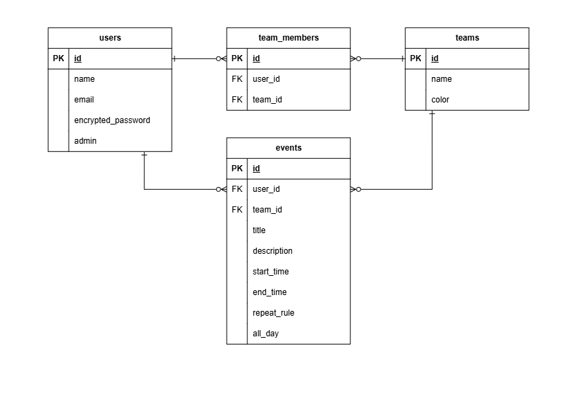

## 機能一覧 
### 認証・ユーザー管理
- ログイン・ログアウト
- パスワード変更(ログイン中)
- パスワードリセット(非ログイン)
- 管理者によるユーザー招待
- 管理者によるユーザー管理

### チーム管理
- 管理者によるチームの作成・編集・削除
- ユーザーのチームへの所属管理
- 複数チームへの所属
- チームごとの予定の色分け

### カレンダー・予定管理
- 予定の作成・編集・削除
- 月間カレンダーによる予定表示
- 個人予定・チーム予定
- 終日予定
- 繰り返し予定
- チーム・ユーザーによる予定の絞り込み
- 日本時間（JST）での予定表示

### メール
- ユーザー招待メールの送信
- パスワードリセットメールの送信

### レスポンシブ対応
- 全画面のレスポンシブ対応

## 画面一覧 

### ログイン画面
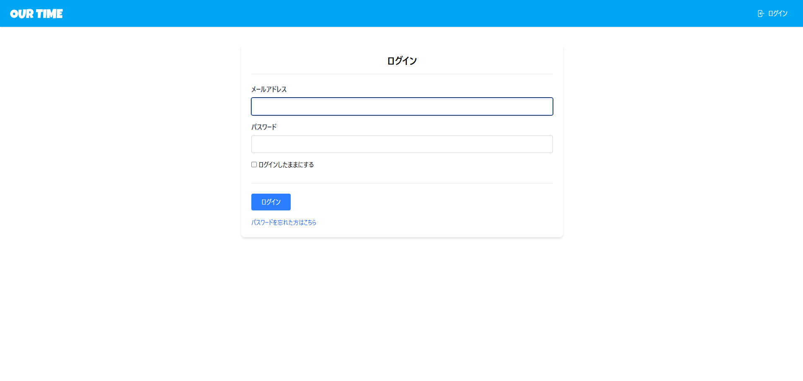

### ホーム画面
カレンダー形式で同じチームメンバーの予定を確認できます。  
サイドバーのチェックボックスをクリックすると、どのユーザー、チームの予定を表示するか変更できます。  
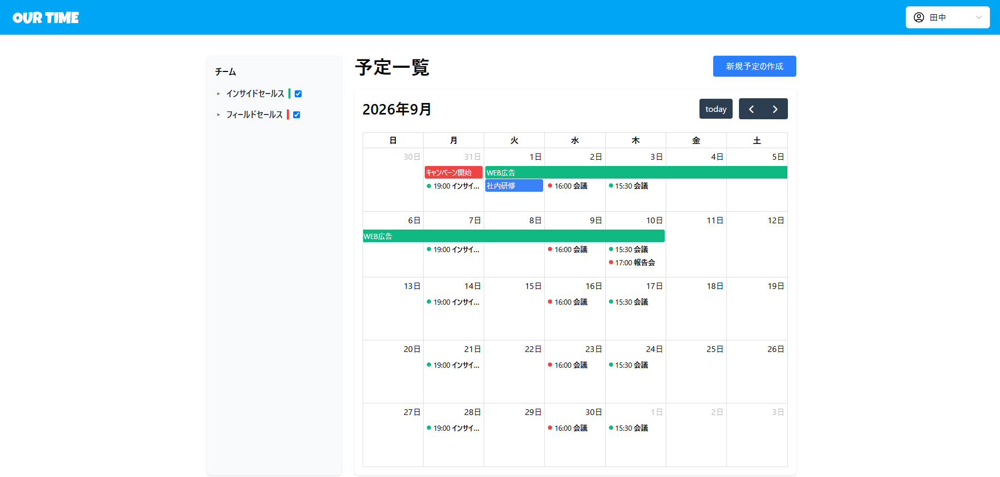

### 予定作成・編集画面
個人予定・チーム予定の作成、繰り返し予定の作成ができます。  
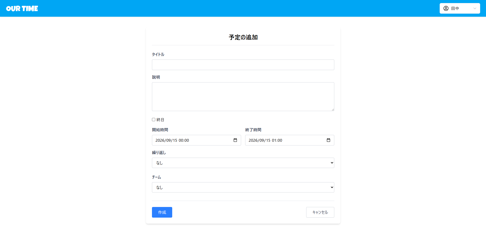

### 予定詳細画面
予定の詳細を確認できます。  
自分が作成した予定の場合のみ、編集ボタンと削除ボタンが表示されます。  
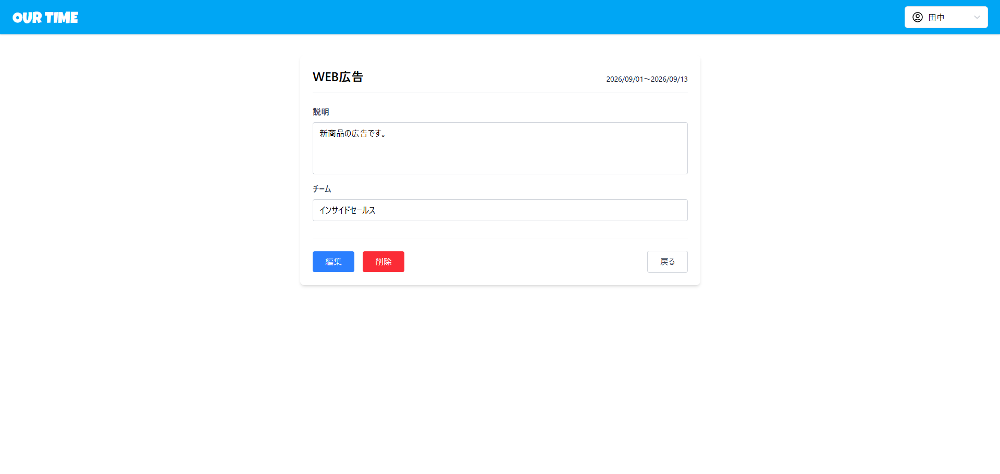

### チーム管理画面
管理者権限のあるユーザーのみアクセス可能です。  
チームの一覧を確認できます。  
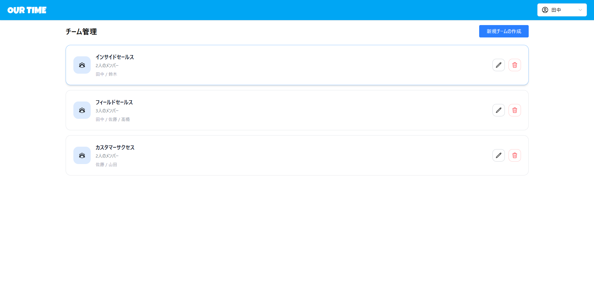

### チーム作成・編集画面
管理者権限のあるユーザーのみアクセス可能です。  
新規チームの作成、既存チームの編集ができます。  
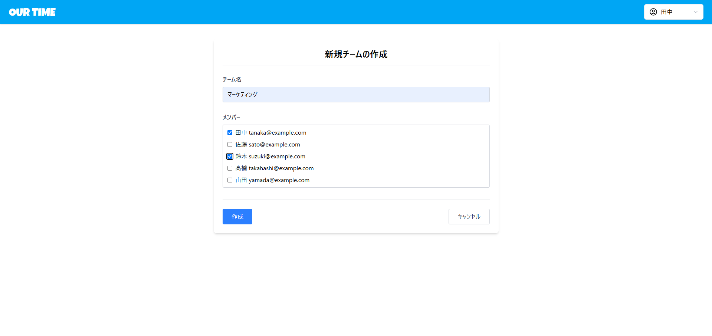

### ユーザー管理画面
管理者権限のあるユーザーのみアクセス可能です。  
ユーザーの一覧を確認できます。  
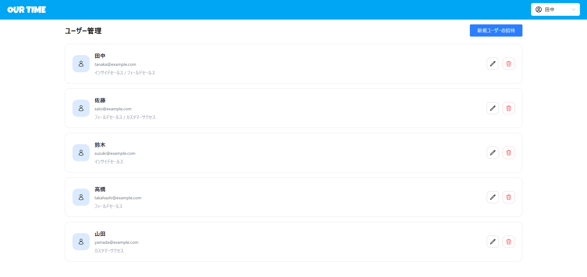

### ユーザー招待・編集画面
管理者権限のあるユーザーのみアクセス可能です。  
新規ユーザーの招待、既存ユーザーの編集ができます。  
新規ユーザーを招待した場合、登録メールアドレス宛に招待メールが送付されます。  
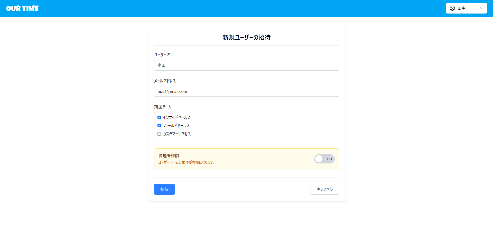

### パスワード設定画面
招待を受けた新規ユーザーがパスワードを設定するための画面です。  
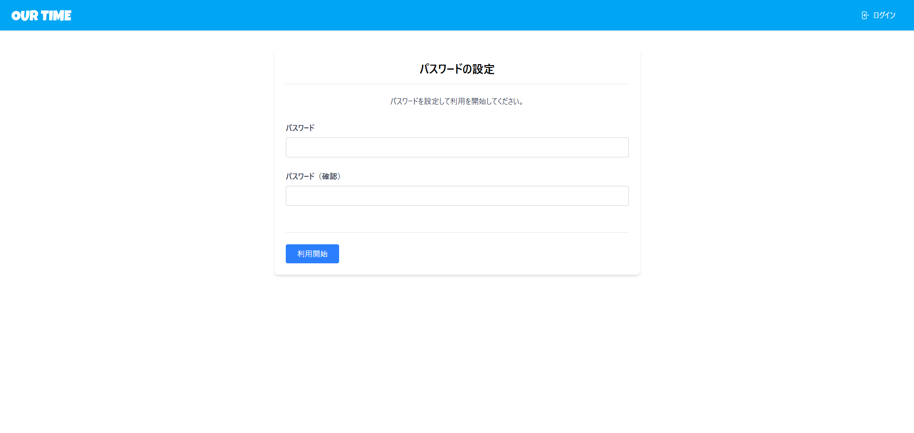

### パスワード変更画面
既存ユーザーがパスワードを変更するための画面です。  
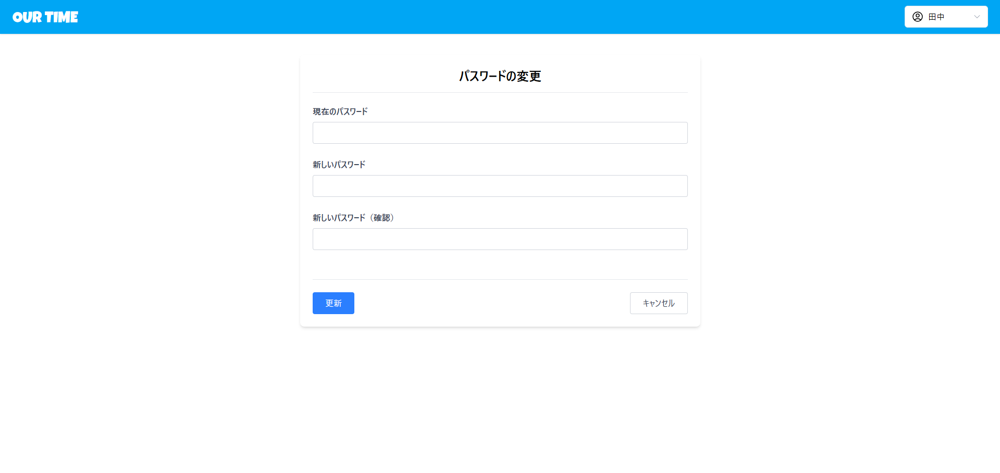

## 工夫した点 

### 個人・チームの予定を一つのカレンダーで管理できる設計
個人予定とチーム予定を同じカレンダー上で管理できるようにしました。  
また、チーム予定にはチームごとのカラーを設定し、
個人予定と各チームの予定を視覚的に判別しやすくしました。  
さらに、サイドバーからチームやユーザーを選択することで、
表示する予定を絞り込めるようにしています。  

---

### IceCubeを利用した繰り返し予定
繰り返し予定の実装にはIceCubeを利用しました。  
繰り返し条件をrepeat_ruleとして保存し、予定の表示時にルールを読み込むことで、
毎日・毎週・毎月・毎年などの繰り返し予定を扱えるようにしました。  

---

### 終日予定に対応した入力フォーム
通常の予定と終日予定では入力する内容が異なるため、
終日予定を選択した場合は時間入力欄から日付入力欄へ切り替えるUIを実装しました。  
Stimulusを利用して入力欄を動的に切り替えることで、
終日予定では不要な時間入力項目を表示しないようにしています。  
また、終日予定の入力でエラーが発生した場合、
「開始時間」「終了時間」ではなく「開始日」「終了日」と表示することで、
入力内容に合わせたエラーメッセージになるようにしました。  

## 苦労した点 

### Docker環境におけるバージョン・依存関係の調整
開発環境をDockerで構築する際、Ruby・Ruby on Rails・Node.js・Tailwind CSS・PostgreSQLなど複数の技術を組み合わせる必要があり、各バージョンや依存関係の調整に苦労しました。  
特にRuby on Railsのアセット管理やJavaScriptのビルド環境を構築する過程で、
GemやNode.jsパッケージの構成によるビルド時のエラーの解決に手間取りました。  
GemfileやDockerfile、Docker Composeの設定を一つずつ見直し、
各ライブラリのバージョンや構成を調整することで、最終的には開発環境を再現可能な状態にできました。  

---

### StimulusとFullCalendarを組み合わせたカレンダーUI
FullCalendarを使ったカレンダー表示と、Stimulusによるチーム・ユーザーの絞り込み機能を連携させることに苦労しました。   
Railsから取得した予定データをFullCalendarに表示するだけでなく、サイドバーで選択したチームやユーザーに応じて、カレンダーに表示する予定を切り替える必要がありました。  
そこで、Rails側では予定データの取得を担当し、Stimulus側ではサイドバーで選択された条件を管理して、FullCalendarの表示に反映するように処理を分けました。  
これにより、カレンダーの表示とサイドバーの操作処理を整理して実装できました。  

---

### GitHub ActionsによるCI/CDの構築
開発した機能の品質を維持するため、GitHub Actionsを利用したCI/CDの仕組みを構築しました。   
CI/CDの構築は初めてだったため、ワークフローの仕組みや設定方法を理解することに苦労しました。  
実行時のエラーについてはログを確認し、原因を切り分けながら設定を調整しました。   
テストを自動実行できる環境を整えることで、コード変更後の動作確認を効率化できました。  

## 今後追加したい機能
- 予定の検索機能
  - 予定のタイトルや内容から検索できるようにする

- 繰り返し予定の詳細設定
  - 繰り返す間隔や曜日などを指定し、より柔軟に繰り返し予定を設定できるようにする

- カレンダーの週表示・日表示
  - 月表示に加えて、週単位・日単位で予定を確認できるようにする

## 前提環境 
- Docker
- Docker Compose

## セットアップ
```bash
git clone https://github.com/nagomi-light/ourtime.git
cd ourtime

docker compose build
docker compose up -d

docker compose exec ourtime_web bundle install
docker compose exec ourtime_web rails db:create
docker compose exec ourtime_web rails db:migrate
docker compose exec ourtime_web rails db:seed
```

## テスト
```bash
docker compose exec ourtime_web bundle exec rspec
```
